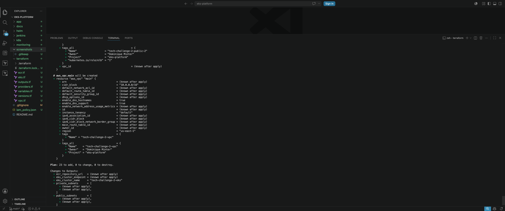
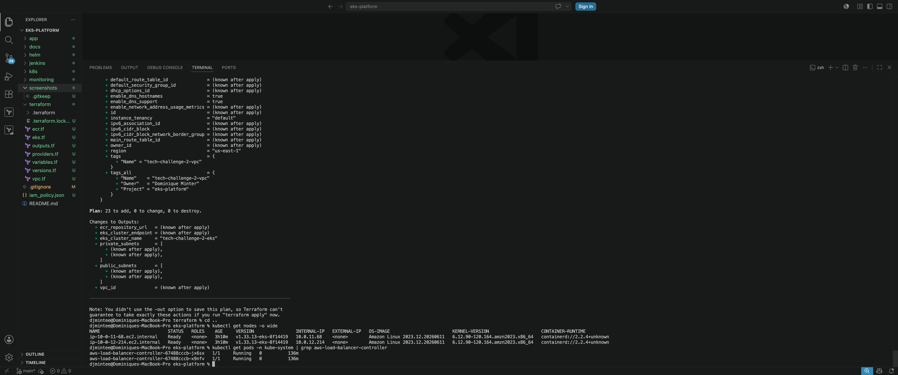
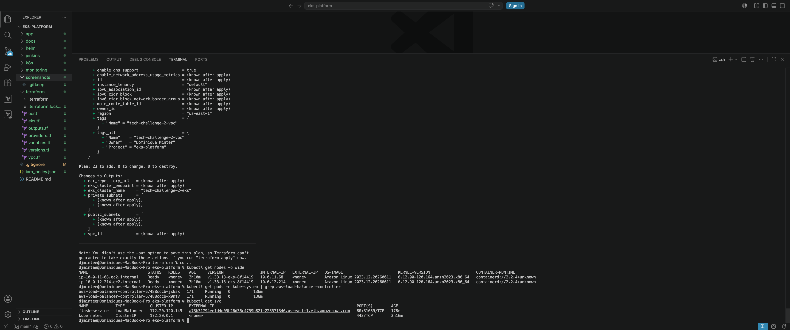
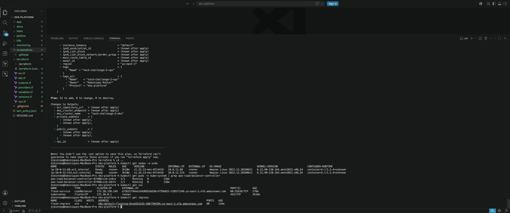
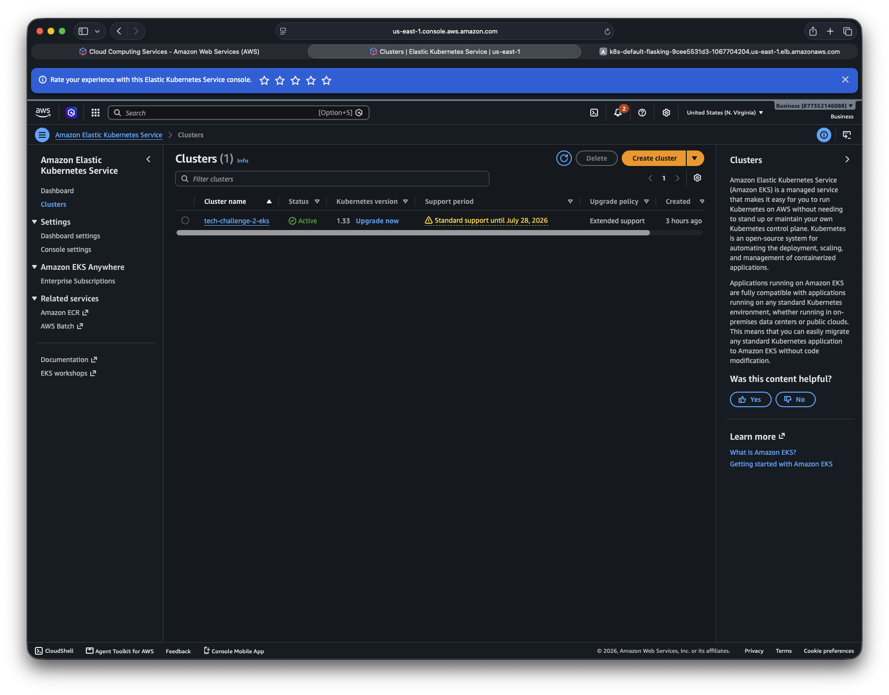
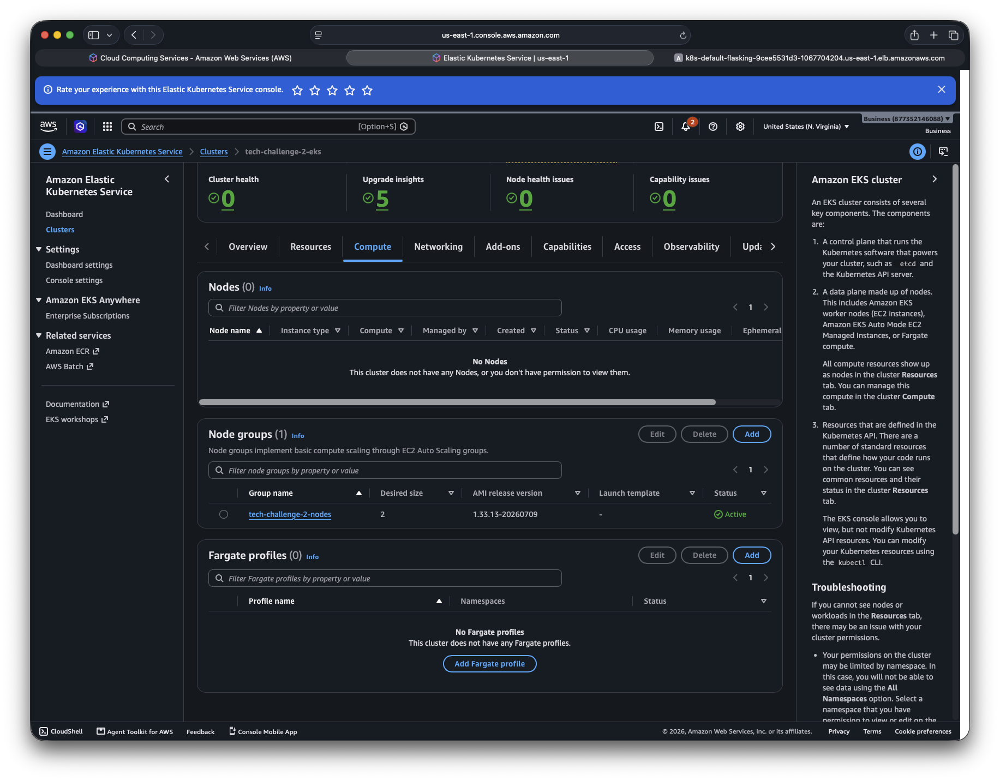
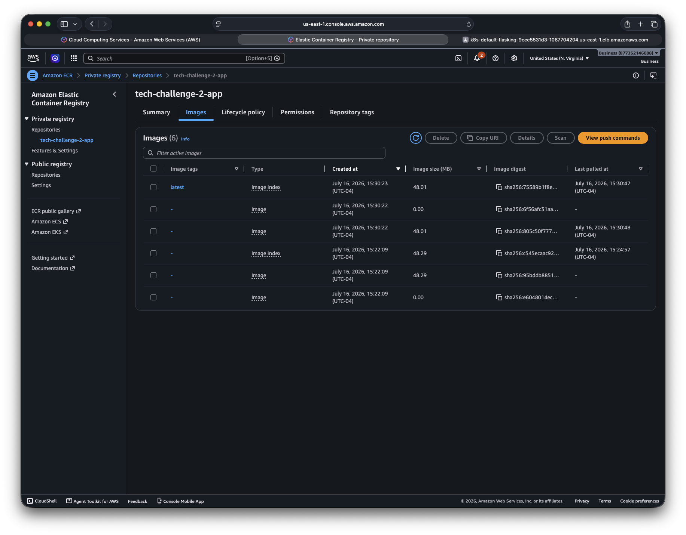
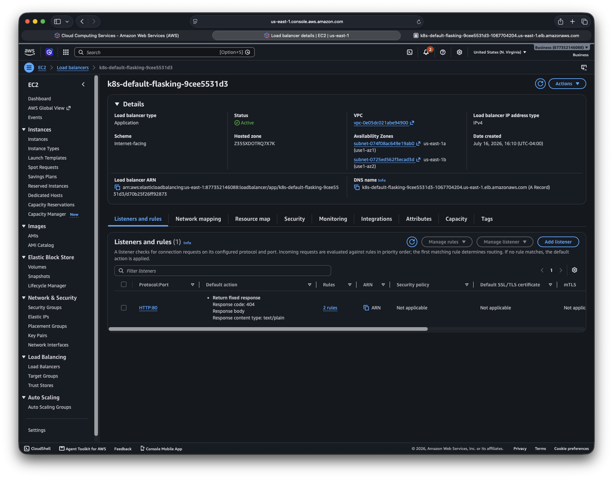
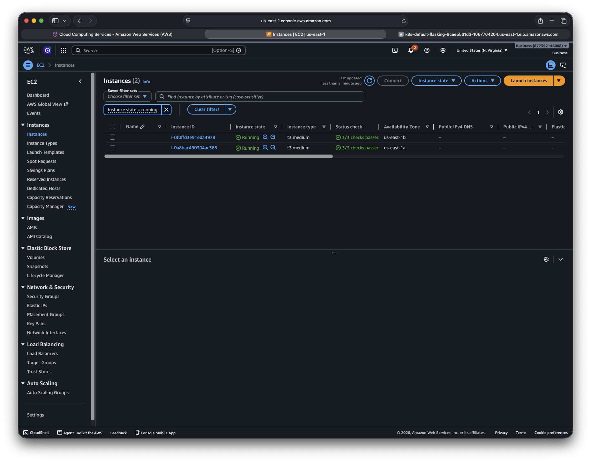
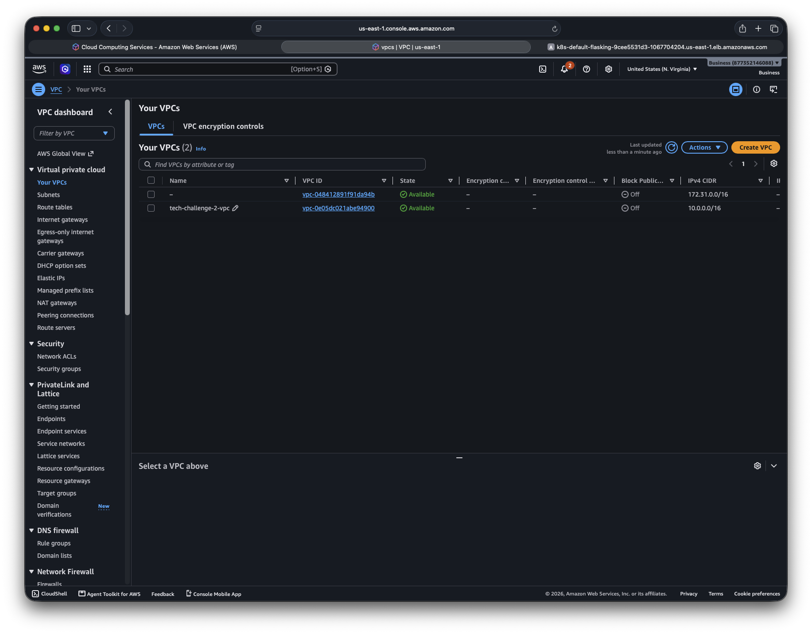

# Enterprise EKS Platform

A production-style Kubernetes platform deployed on Amazon EKS using Terraform, Docker, Kubernetes, Amazon ECR, Helm, Jenkins, and the AWS Load Balancer Controller. This project expands a basic Kubernetes deployment into a more production-oriented platform by automating infrastructure provisioning, application deployment, load balancing, and CI/CD while incorporating real-world troubleshooting and operational practices.

---

# Architecture

Client
↓
Application Load Balancer (AWS Load Balancer Controller)
↓
Ingress
↓
Kubernetes Service
↓
Flask Application Pods
↓
Amazon EKS Worker Nodes
↓
Private Subnets inside custom VPC

Infrastructure managed with Terraform.

---

# Technologies

- AWS EKS
- Terraform
- Docker
- Kubernetes
- Amazon ECR
- Application Load Balancer
- AWS Load Balancer Controller
- IAM Roles
- VPC
- Public & Private Subnets
- Internet Gateway
- NAT Gateway
- EC2
- kubectl
- YAML

---

# Features

- Infrastructure deployed with Terraform
- Custom VPC
- Public and Private Subnets
- Managed EKS Cluster
- Managed Node Group
- Dockerized Flask application
- Images stored in Amazon ECR
- Kubernetes Deployment
- Kubernetes Service
- Kubernetes Ingress
- AWS Load Balancer Controller
- Internet-facing Application Load Balancer
- End-to-end application deployment

---

# Project Structure

```
eks-platform/
├── app/
├── terraform/
├── k8s/
├── monitoring/
├── helm/
├── screenshots/
├── README.md
```

---

# Deployment Workflow

1. Terraform provisions AWS infrastructure
2. EKS cluster is created
3. Docker image is built
4. Image pushed to Amazon ECR
5. Kubernetes manifests deployed
6. AWS Load Balancer Controller creates ALB
7. Ingress routes traffic to Flask application
8. Application becomes publicly accessible

---

# Screenshots

## Live Application


---

## Terraform Plan



---

## Worker Nodes


---

## AWS Load Balancer Controller



---

## Kubernetes LoadBalancer Service



---

## Kubernetes Ingress



---

## Amazon EKS Cluster



---

## Managed Node Group



---

## Amazon ECR Repository



---

## Application Load Balancer



---

## EC2 Worker Instances



---

## Custom VPC



---

## Public and Private Subnets


---

# Skills Demonstrated

- Infrastructure as Code
- Kubernetes Administration
- Containerization
- AWS Networking
- Application Deployment
- Load Balancing
- IAM Configuration
- Terraform Modules
- Docker
- Amazon EKS
- Amazon ECR
- Kubernetes Services
- Kubernetes Ingress
- AWS Load Balancer Controller
- Cloud Architecture
- Troubleshooting

---

# Future Improvements

- Helm Charts
- Prometheus Monitoring
- Grafana Dashboards
- CI/CD Pipeline
- GitHub Actions
- ArgoCD
- Horizontal Pod Autoscaler
- External DNS
- Route53 Integration
- HTTPS with ACM

---

# Author

Dominique Minter

AWS • Kubernetes • Terraform • DevOps • Cloud Engineering
